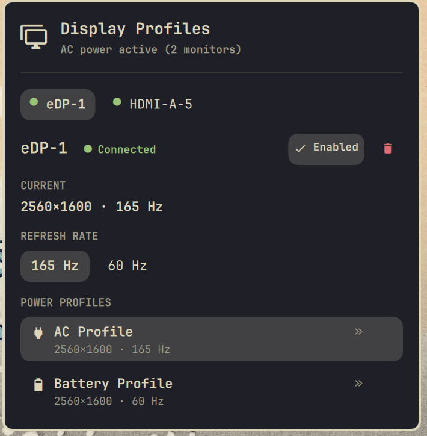
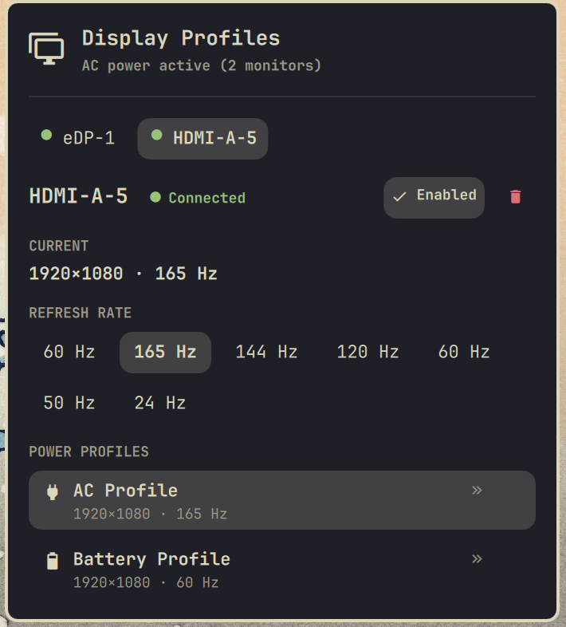
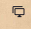

# Battery Display Profiles

<p align="center">
  
</p>

<p align="center">
  <a href="https://github.com/Hazem-Ahmed-Salem/battery-display-profiles/releases"></a>
  <a href="LICENSE"></a>
  <a href="https://omarchy.org"></a>
  <a href="https://hyprland.org"></a>
</p>

A native **Omarchy 4** plugin and status bar widget that automatically manages display refresh rates based on power state across multiple monitors independently:

- 󰚥 **AC Power (Plugged In)** ➔ `acMode` (highest refresh rate at current resolution, e.g. 165Hz / 144Hz / 240Hz)
- 󰂁 **Battery (Unplugged)** ➔ `batteryMode` (power-saving smooth refresh rate at current resolution, e.g. 60Hz)

Features zero-touch display auto-detection, strict resolution preservation, zero-polling reactive power state tracking, an interactive status bar widget with quick overrides, and multi-layered self-healing protection.

---

## Visual Overview

<div align="center">

| Internal Laptop Display (`eDP-1`) | External High-Refresh Monitor (`HDMI-A-5`) |
| :---: | :---: |
|  |  |
| *Single/primary display running at 2560×1600 with quick 165 Hz / 60 Hz toggles and dedicated AC/Battery profiles.* | *Independent multi-monitor management with complete hardware refresh rate spectrum (24 Hz – 165 Hz).* |

</div>

<p align="center">
  
  &nbsp;&nbsp;<b>Dynamic Bar Glyph</b>: The status bar button adapts automatically to show a single monitor or stacked multi-monitor icon.
</p>

---

## Installation & Uninstallation

### Option 1: Using Omarchy Plugin Commands (Recommended)

#### Install
```bash
# Add and enable the plugin directly into the right bar section
omarchy plugin add https://github.com/Hazem-Ahmed-Salem/battery-display-profiles.git --enable --yes
```

If you prefer to specify the bar section manually:
```bash
omarchy plugin add https://github.com/Hazem-Ahmed-Salem/battery-display-profiles.git --yes
omarchy plugin enable battery-display-profiles right
```

#### Update
```bash
omarchy plugin update battery-display-profiles --yes
```

#### Uninstall
```bash
# Disable and remove the plugin completely
omarchy plugin disable battery-display-profiles
omarchy plugin remove battery-display-profiles --yes
```

---

### Option 2: Manual Installation & Uninstallation

#### Manual Install
```bash
# 1. Clone into your local Omarchy plugins directory
git clone https://github.com/Hazem-Ahmed-Salem/battery-display-profiles.git ~/.config/omarchy/plugins/battery-display-profiles

# 2. Rescan plugins to register the new plugin
omarchy-shell shell rescanPlugins

# 3. Enable the bar widget (left, center, or right)
omarchy plugin enable battery-display-profiles right
```

#### Manual Uninstall
```bash
# 1. Disable the plugin
omarchy plugin disable battery-display-profiles

# 2. Delete the plugin folder
rm -rf ~/.config/omarchy/plugins/battery-display-profiles

# 3. Rescan plugins to refresh shell registry
omarchy-shell shell rescanPlugins
```

---

## Key Features

- **Zero-Touch Display Auto-Detection**: Automatically discovers any connected monitor (internal laptop eDP, HDMI, DisplayPort, USB-C) at startup and during hotplug events. Default AC and Battery modes are configured out of the box with zero manual setup.
- **Strict Resolution Preservation**: Mode switching **never** alters your display resolution. If a display runs at 2560×1600 or 1920×1080, only the refresh rate changes (e.g. 165Hz ↔ 60Hz).
- **Rotated & Portrait Display Support**: Seamlessly accommodates transformed displays (90° / 270°) by evaluating physical dimensions against transformed viewports.
- **Smart Refresh Rate Selection**:
  - **AC Default**: Highest available refresh rate for the active resolution.
  - **Battery Default**: Lowest smooth refresh rate ($\ge 59\,\text{Hz}$), intelligently avoiding unusable 24/30 Hz cinema/TV modes on external displays.
- **User Preference Retention**: Custom refresh rate selections configured via the Bar Widget are persisted to disk and preserved across reboots and shell restarts.
- **Multi-Layered Self-Healing**:
  - Validates modes against hardware capabilities before executing any compositor call.
  - If a saved profile is invalid, missing, or references an outdated resolution, it safely falls back to a verified auto-detected default without crashing or blanking the screen.
- **Strict Multi-Monitor Isolation**: Uses Hyprland's Lua runtime evaluation (`hyprctl eval 'hl.monitor({ output = "...", mode = "..." })'`) targeting only `output` and `mode`. Never resets window layout, scaling, positions, transforms, VRR, or workspace bindings.
- **Zero-Polling & Fully Event-Driven**:
  - Power state is tracked via instantaneous signals from `Quickshell.Services.UPower.onBattery`.
  - Monitor hotplugging is tracked via reactive `Quickshell.screens` signals.
  - Zero timer loops, zero `while true` sleep scripts, and zero daemon overhead.
- **Immediate Reaction**: Watches `~/.config/omarchy/shell.json` via live file watchers. Modifying a profile in the UI immediately applies to the active power state.
- **Native Quattro Bar Widget**:
  - Dynamic status bar glyph indicating single or multi-monitor setups.
  - Monitor tabs with live connection status dots (`●`) and disabled indicators.
  - Quick refresh rate toggle buttons for instantaneous manual overrides.
  - Detailed AC and Battery profile cards with interactive mode pickers.
  - Disconnected monitor safety: Disconnected displays are preserved in settings and skipped cleanly.

---

## Architecture

```text
  ┌────────────────────────────────┐       ┌────────────────────────────────┐
  │   Quickshell.Services.UPower   │       │       Quickshell.screens       │
  │     (Power State Changes)      │       │     (Monitor Plug/Unplug)      │
  └───────────────┬────────────────┘       └───────────────┬────────────────┘
                  │                                        │
                  ▼                                        ▼
  ┌─────────────────────────────────────────────────────────────────────────┐
  │                               Service.qml                               │
  │  - Reconciles live screens against configured profiles                  │
  │  - Auto-assigns default AC & Battery modes matching current resolution │
  │  - Manages sequential per-monitor application queue                     │
  │  - In-memory applied state tracking & cache invalidation                │
  └───────────────────────────────────┬─────────────────────────────────────┘
                                      │
                                      ▼
  ┌─────────────────────────────────────────────────────────────────────────┐
  │                          DisplayController.qml                          │
  │  - Mode normalization with numeric tolerance (~0.1 Hz)                  │
  │  - Resolution-preserving mode filtering (modesForCurrentResolution)     │
  │  - Safe Lua mode dispatch: hyprctl eval 'hl.monitor(...)'               │
  │  - Post-switch hardware verification: hyprctl monitors -j              │
  └───────────────────────────────────┬─────────────────────────────────────┘
                                      │
                                      ▼
                         ┌─────────────────────────┐
                         │   Hyprland Compositor   │
                         └─────────────────────────┘
```

### Component Breakdown

| Component | Responsibility |
| :--- | :--- |
| **`Service.qml`** | Background headless service. Manages power state changes, monitor discovery reconciliation, per-monitor queue execution, configuration reloading, and safe CLI persistence. |
| **`DisplayController.qml`** | Hyprland interface. Queries monitors, normalizes refresh rates with floating-point tolerance, filters modes strictly matching active resolution, validates modes, and verifies mode switches. |
| **`BarWidget.qml`** | Interactive Omarchy Quattro panel widget. Monitor tabs, active monitor controls, quick manual refresh rate buttons, and profile pickers. |
| **`manifest.json`** | Plugin manifest declaring kinds (`service`, `bar-widget`), schema, defaults, and entry points. |

---

## Configuration

Settings are saved in `~/.config/omarchy/shell.json` under your bar configuration:

```json
{
  "id": "battery-display-profiles",
  "monitors": [
    {
      "name": "eDP-1",
      "enabled": true,
      "acMode": "2560x1600@165",
      "batteryMode": "2560x1600@60"
    },
    {
      "name": "HDMI-A-5",
      "enabled": true,
      "acMode": "1920x1080@165",
      "batteryMode": "1920x1080@60"
    }
  ],
  "monitor": "eDP-1",
  "acMode": "2560x1600@165",
  "batteryMode": "2560x1600@60"
}
```

### Monitor Schema

| Property | Type | Default | Description |
| :--- | :--- | :--- | :--- |
| `name` | `string` | *(auto-detected)* | Output connector identifier (e.g. `eDP-1`, `DP-1`, `HDMI-A-1`). |
| `enabled` | `boolean` | `true` | When `false`, automatic switching is suspended for this monitor. |
| `acMode` | `string` | *(highest Hz)* | Target mode when connected to AC power. |
| `batteryMode` | `string` | *(lowest Hz)* | Target mode when running on battery power. |

> [!NOTE]
> `monitor`, `acMode`, and `batteryMode` root properties are automatically mirrored from the primary monitor for backwards compatibility with legacy single-monitor readers.

---

## Bar Widget Guide

Click the display icon in the bar to open the popup surface:

1. **Monitor Tabs**: Switch between configured monitors. Green dot (`●`) indicates connected; grey dot indicates disconnected; `(off)` indicates disabled.
2. **Enable / Disable Toggle**: Temporarily suspend profile switching for a specific monitor without removing its settings.
3. **Quick Refresh Rate**: One-click pills to immediately change refresh rate at the current resolution for testing or ad-hoc tasks.
4. **AC & Battery Profiles**: Click on either card to open the mode selector. Available options are automatically filtered to modes matching the display's active resolution.
5. **Add / Remove Monitor**: Seamlessly manage newly connected external screens or remove obsolete entries.

---


## Requirements

- **Omarchy 4 (Quattro)**
- **Arch Linux**
- **Hyprland**
- **Quickshell**
- **UPower**

---

## License

[MIT License](LICENSE) © Hazem Ahmed Salem